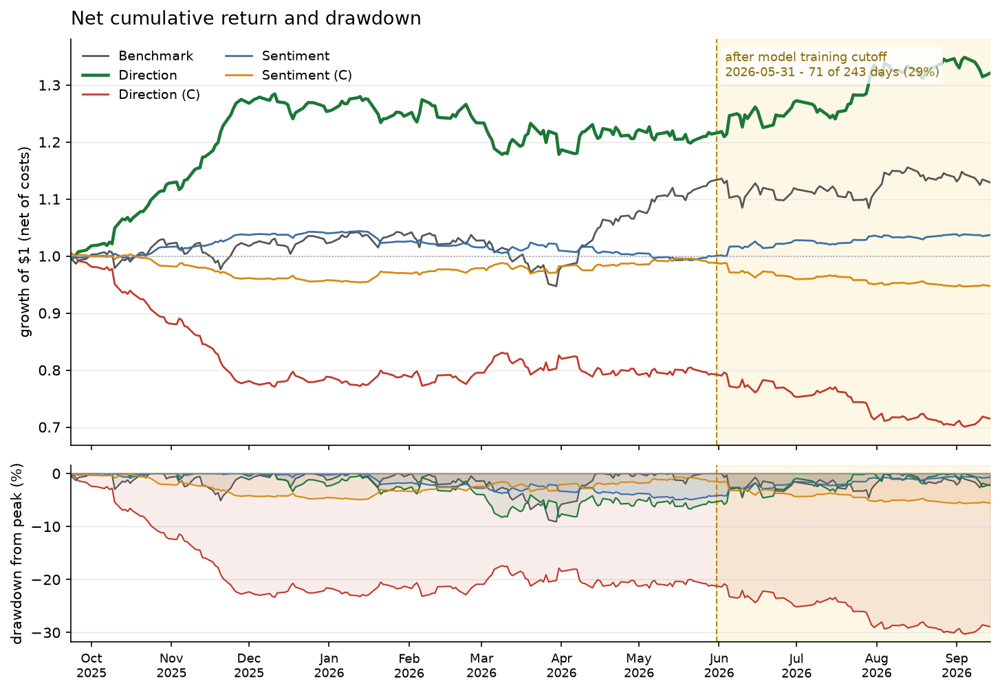
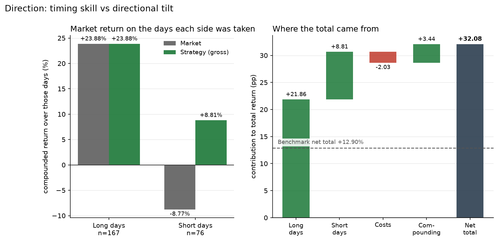
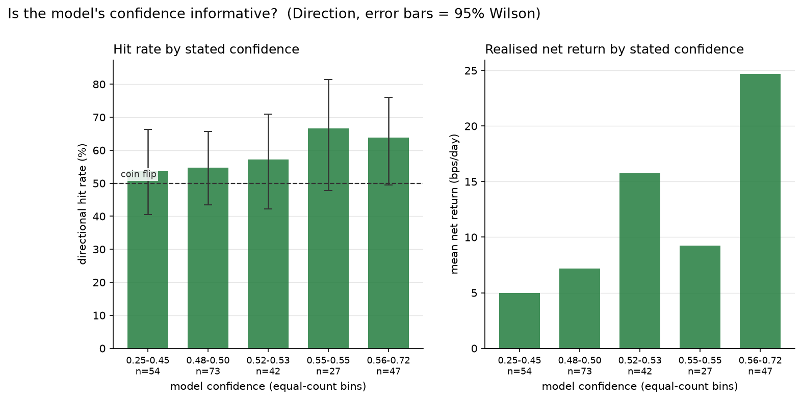

# Strategy performance

**2025-09-23 .. 2026-09-14 — 243 trading days — 5 strategies**

Source: `C:\Users\Gordon Hew\workspace\news_based_ai\data\predictions_strategy.csv` (1215 rows).
Risk-free: `C:\Users\Gordon Hew\workspace\news_based_ai\data\market_returns.csv`, `rf_daily`, mean 0.00014849/day = 3.81%/yr over 243 day(s), 2 gap(s) filled.

> ### Read this before the tables
>
> - **VaR and CVaR are historical (empirical) quantiles**, no interpolation: the k-th worst day with k = ceil((1-conf)·n), here k = 13 at 95% and k = 3 at 99%.
> - **Sharpe is computed on excess returns** (return − `rf_daily`). `scripts/predict_positions.py`'s console summary does not subtract `rf`, so its Sharpe column is overstated. Where the two disagree, this file is correct.
> - **VaR and CVaR are signed returns: negative is a loss**, on a 1-day horizon. Not annualized, not scaled.

**Legend** — `(C)` = Contrarian.

| Short | Full name |
|---|---|
| Benchmark | Benchmark |
| Direction | LLM Direction |
| Direction (C) | LLM Direction (Contrarian) |
| Sentiment | LLM Sentiment-Weighted |
| Sentiment (C) | LLM Sentiment-Weighted (Contrarian) |

## Findings

Everything in this section is computed from the tables below, not written alongside them, so it cannot fall out of step with the numbers it cites.

1. **LLM Direction is the only strategy that beats buy-and-hold, and it does so on risk as well as return.**

   It returns **+32.08% net against +12.90%** for the Benchmark (+34.79% vs +13.02% gross), at an excess Sharpe of **2.01 vs 0.74** and a Sortino of 3.72 vs 1.50. The return is not bought with volatility: annualized volatility is 12.89% against the Benchmark's 13.03%, and the maximum drawdown is -8.26% against -9.11% — *shallower*, not deeper. Its left tail is thinner too: 95% VaR -1.174% against -1.437%, and 99% CVaR -2.246% against -2.473%.

2. **The calls carry directional information — the contrarian mirror is the evidence.**

   Inverting the same calls turns +32.08% into **-28.52%** and a Sharpe of 2.01 into **-2.92**. A signal with no directional content could not do this: both halves would drift toward the Benchmark's +12.90% rather than separating by 60.6 percentage points. Note the two are *not* exact negatives — only the daily gross returns negate, while compounding and strictly-positive costs break the symmetry, which is why +34.79% gross becomes -27.01% rather than -34.79%.

3. **Sizing by sentiment destroys the edge rather than refining it.**

   LLM Direction and LLM Sentiment-Weighted read the *same* model output, yet sentiment-weighting returns only **+3.70% net** at a Sharpe of **0.03**, against +32.08% and 2.01. The cause is exposure, not accuracy: mean |position| is 0.293 against 1.000, which cuts annualized volatility to 4.69% from 12.89% and leaves the strategy flat on 21 of 243 days. Its win rate on the days it does hold a position, 54.5%, is close to LLM Direction's 56.8% — the signal is comparable, the capital behind it is not. Note also that its net Sharpe (0.03) is far below its gross (0.20): at this exposure the 0.78% cost bill is proportionally much heavier.

4. **Trading costs are material but survivable at the modelled level.**

   LLM Direction pays **2.03% in cost** over the sample and gives up **2.71 percentage points** of compounded return, turning +34.79% gross into +32.08% net, with the Sharpe falling -0.16. That bill is driven by **197.9x annualized turnover** — 39% of the 504x theoretical maximum for a book flipping fully long to fully short every session — across 96 days with a trade. The edge clears the bill with room to spare, but it is the assumption most worth stressing: the strategy is far more cost-sensitive than the Benchmark, which pays 0.10% in total.

5. **The statistical evidence is real but moderate, not overwhelming.**

   LLM Direction's mean daily net return carries a t-statistic of **2.26** over 243 days — significant at the 5% level, and no more. The standard error on an annualized Sharpe from this many observations is about **±1.02**, so the 2.01 figure is roughly 2.0 standard errors from zero. Neither number is corrected for the fact that this report tabulates 5 strategies and the best one is being quoted.

6. **The edge does not collapse after the model's training cutoff — but the out-of-sample window is too short to settle it.**

   172 of 243 days (71%) fall on or before 2026-05-31 and are inside the model's training data, so for most of this sample the model may be recalling outcomes rather than forecasting them. Splitting there: LLM Direction returns +21.40% before the cutoff and **+8.80% after** it, at a post-cutoff Sharpe of 2.09 against 1.98 before, while the Benchmark returned -0.22% over the same post-cutoff stretch. The edge persisting out of sample is the strongest evidence here that it is not pure memorisation — but 71 days carry a Sharpe standard error of about ±1.88, so that post-cutoff figure sits only 1.1 standard errors from zero and settles nothing on its own. This is the single largest open question in the report.

## Performance metrics — gross vs net

Each strategy occupies two columns: **gross** before trading costs and **net** after them. The difference between an adjacent pair is what trading the strategy costs on that metric.

| Metric | Benchmark gross | Benchmark net | Direction gross | Direction net | Direction (C) gross | Direction (C) net | Sentiment gross | Sentiment net | Sentiment (C) gross | Sentiment (C) net |
|---|---:|---:|---:|---:|---:|---:|---:|---:|---:|---:|
| Total return | +13.02% | +12.90% | +34.79% | +32.08% | -27.01% | -28.52% | +4.51% | +3.70% | -4.52% | -5.26% |
| Annualized return (geometric) | +13.53% | +13.41% | +36.29% | +33.45% | -27.86% | -29.40% | +4.68% | +3.84% | -4.68% | -5.45% |
| Annualized volatility | 13.03% | 13.03% | 12.90% | 12.89% | 12.90% | 12.92% | 4.69% | 4.69% | 4.69% | 4.69% |
| Sharpe (excess, annualized) | 0.75 | 0.74 | 2.18 | 2.01 | -2.76 | -2.92 | 0.20 | 0.03 | -1.80 | -1.97 |
| Sortino (annualized) | 1.51 | 1.50 | 4.01 | 3.72 | -3.08 | -3.25 | 1.52 | 1.25 | -1.32 | -1.54 |
| Maximum drawdown | -9.10% | -9.11% | -7.89% | -8.26% | -28.87% | -30.29% | -4.65% | -4.93% | -4.98% | -5.65% |
| VaR 95%, historical † | -1.436% | -1.437% | -1.159% | -1.174% | -1.547% | -1.548% | -0.434% | -0.440% | -0.490% | -0.496% |
| VaR 99%, historical † | -2.063% | -2.063% | -1.741% | -1.741% | -2.508% | -2.509% | -0.707% | -0.713% | -0.983% | -0.990% |
| CVaR 95% (expected shortfall) † | -1.786% | -1.786% | -1.548% | -1.557% | -1.898% | -1.914% | -0.658% | -0.662% | -0.739% | -0.745% |
| CVaR 99% (expected shortfall) † | -2.473% | -2.473% | -2.239% | -2.246% | -2.621% | -2.635% | -1.037% | -1.042% | -1.187% | -1.195% |
| Win rate, days in position | 53.9% | 53.9% | 58.0% | 56.8% | 42.0% | 42.0% | 55.4% | 54.5% | 44.6% | 43.2% |
| Win rate, all days | 53.9% | 53.9% | 58.0% | 56.8% | 42.0% | 42.0% | 50.6% | 49.8% | 40.7% | 39.5% |

*Growth of $1 after trading costs (top) and drawdown from the running peak (bottom), both on the net series tabulated above. The shaded band covers days after the model's training cutoff (2026-05-31) — the only stretch of this sample the model could not have memorised. Read the slope inside the band against the slope outside it.*

## Trading activity and cost

| Metric | Benchmark | Direction | Direction (C) | Sentiment | Sentiment (C) |
|---|---:|---:|---:|---:|---:|
| Observations (days) | 243 | 243 | 243 | 243 | 243 |
| Flat days (position = 0) | 0 | 0 | 0 | 21 | 21 |
| Total cost paid (sum of daily) | 0.1011% | 2.0344% | 2.0744% | 0.7806% | 0.7841% |
| Gross − net (total return) | 0.11 pp | 2.71 pp | 1.50 pp | 0.81 pp | 0.75 pp |
| Turnover (total, one-way units) | 1.00 | 191.00 | 191.00 | 74.00 | 74.00 |
| of which day-1 entry | 1.00 | 1.00 | 1.00 | 0.60 | 0.60 |
| Turnover (annualized, ex-entry) ‡ | 0.0x | 197.9x | 197.9x | 76.4x | 76.4x |
| Days with a trade | 1 | 96 | 96 | 173 | 173 |
| Mean \|position\| | 1.000 | 1.000 | 1.000 | 0.293 | 0.293 |
| Mean signed position | +1.000 | +0.374 | -0.374 | +0.033 | -0.033 |
| Sharpe drag from costs | -0.01 | -0.16 | -0.16 | -0.17 | -0.17 |

‡ Turnover is the sum of `|position_t − position_{t-1}|` with `position_0 = 0`. The day-1 entry is a one-off cost of establishing the book, not a rate, so the annualized figure excludes it and divides the remainder over the 242 days on which rebalancing could occur. Benchmark is 0.0x because buy-and-hold trades once and never again. A book flipping fully long to fully short every day would show 504x.

*Left: what the market did on the days the strategy chose each side. Holding long through a rising year earns money without any skill at all, so the short-day pair is where security selection has to show up. Right: an additive decomposition of the net total. Daily returns are summed rather than compounded so the parts add up; the gap against the true compounded total is carried explicitly as the `Compounding` bar instead of being absorbed into rounding.*

## Signal quality

The model states a `confidence` between 0 and 1 on every call, and **no strategy in this report uses it**. The figure below tests it against what actually happened, so it is the one result here that is not already priced into the tables above.

*Left: directional hit rate by equal-count confidence bin, with 95% Wilson intervals and a 50% reference line. Right: the mean net return actually earned in each bin. A profile that rises left to right would justify sizing by confidence, or standing aside below a threshold; a flat one says the self-assessment carries no information and should be ignored. Bins are equal-count rather than equal-width because confidence clusters tightly around its mean.*

## Notes

- **Total return is compounded**, not summed.
- **Annualized return is geometric**, `(1 + total) ** (252/n) - 1`, so it reconciles with the total-return row directly.
- **Annualized volatility** is the sample standard deviation (n−1) of the raw series × √252. Sharpe uses the standard deviation of the *excess* series, which is the textbook definition.
- **Sortino** uses a minimum acceptable return of **0%**. Downside deviation is `sqrt(Σ min(r−MAR, 0)² / n)` — divided by **n**, the full sample count, not by the number of losing days. The loser-count form discards loss-frequency information and is non-monotone: turning a losing day into a winning one could *raise* the denominator and *lower* the ratio.
  Because MAR = 0, Sortino's numerator is the mean **raw** return while Sharpe's is the mean **excess** return, so the two ratios are measured against different benchmarks and are not directly comparable. `--sortino-mar rf` makes them consistent.
- A **negative Sharpe or Sortino ranks nothing**: once the numerator is negative, a larger denominator moves the ratio toward zero.
- **Win rate, days in position** excludes days a strategy deliberately held no position. Standing aside on a neutral read is not a loss, but a strict `return > 0` test scores it as one. Flat days are counted from `Position == 0`, not `return == 0`, so the gross and net columns share a denominator. The denominators themselves are the observation and flat-day counts in the activity table: days in position = observations − flat days.
- **Maximum drawdown** is close-to-close on the strategy's own equity curve and understates intraday drawdown.
- Contrarian variants are **not** the exact negative of their parent. Only the daily *gross* return negates; compounded totals do not, and costs are strictly positive on both sides.
- A high Sharpe on a low-exposure strategy is low volatility, not necessarily skill — check the `Mean |position|` row.
- **Figures are drawn on net returns** and are regenerated on every run; they are written to `C:\Users\Gordon Hew\workspace\news_based_ai\output\charts`. Pass `--no-charts` to skip them, which is also what happens automatically if matplotlib is not installed.

## Data sources and coverage

Row counts and date ranges below are measured from the files at report time, not recorded by hand.

| File | Source | Used for | Coverage | Rows |
|---|---|---|---|---:|
| `cnbc_headlines.csv` | GDELT 2.0 DOC API (`artlist`, `domainis:cnbc.com`) | The headlines each prediction was made from. | 2025-09-20 .. 2026-09-13 (354 days) | 9,628 |
| `predictions.csv` | `claude-opus-5` via the Anthropic API | One long/short call, sentiment score and confidence per trading day. Coverage is by `predicts_for`, the day each call applies to, not the session it was made on. | 2025-09-23 .. 2026-09-14 | 243 |
| `market_returns.csv` | FRED `SP500` (S&P 500 close, a PRICE index) and `DGS1MO` (1-month Treasury constant maturity yield) | Realised returns that positions are scored against, and the risk-free rate subtracted for Sharpe. | 2016-09-20 .. 2026-09-17 | 2,512 |
| `predictions_strategy.csv` | Generated by `scripts/predict_positions.py --backtest-only` | Per-day positions, returns and costs. The direct input to this report. | 2025-09-23 .. 2026-09-14 | 1,215 |

### Why the windows differ

- **Headlines** span 2025-09-20 to 2026-09-13, wider at both ends than the backtest. A prediction is made from the *prior* session's headlines, so the first day of headlines produces no scored day of its own.
- **Predictions** are dated by the session whose headlines were read; the `predicts_for` column carries the day they apply to. The backtest is indexed on the latter.
- **The backtest** runs 2025-09-23 to 2026-09-14 (243 days). It stops short of the last headline because the final prediction still needs a following day's return to be scored against.

### Gaps, cutoffs and exclusions

- **2,908 of 9,628 headlines (30.2%) were excluded by the point-in-time filter** — they carry a `seendate` at or after the 4:00 PM ET close (1:00 PM on the six early-close sessions), so a trade placed that day could not have been informed by them. Only the remaining 6,720 reached the model. This is the largest single exclusion in the pipeline and the one that keeps the backtest honest.
- **37 day(s) are recorded in `cnbc_year_empty.txt` as returning no headlines at all.** These are logged rather than silently treated as quiet news days, because a collection failure and a genuinely empty day are not the same thing and must not become the same row.
- **Risk-free rate: mean 0.00014849/day = 3.81%/yr over 243 day(s), 2 gap(s) filled.** The gaps are structural — the NYSE trades on Columbus Day and Veterans Day while the bond market is shut, so FRED publishes no `DGS1MO` quote. The prior session's rate is carried forward; the two rates either side of each gap differ by less than 0.01%/yr, so the substitution is very nearly exact.
- **`SP500` is a price index, so every return here excludes dividends** — roughly 1.2–1.5%/yr understated. It applies identically to the strategies and the benchmark, so comparisons between them are unaffected, but the absolute totals are each a little low.
- **Ken French's `Mkt-RF` factor was NOT used**, though it is present in `data/`. It ends 2026-07-31, 217 rows covering only to that date, because the library is rebuilt from a monthly CRSP vintage and runs roughly seven weeks in arrears — it stops short of the backtest end. It is also an *already-excess*, dividend-inclusive, whole-CRSP series, where these strategies were scored on total returns of the S&P 500; `performance_analysis.py` refuses it for that reason.
- **172 of 243 days (71%) fall on or before 2026-05-31**, the assistant's training cutoff, and are therefore inside the model's training data. See the Findings section.
- **`seendate` is when GDELT first indexed an article**, which is at or after publication, never before. Filtering on it is therefore conservative in the safe direction: it can exclude a borderline article, but it cannot admit one the trader could not have seen.

## Appendix: acquiring the GDELT data

A fixed record of what went wrong collecting the headline corpus, and what
would have prevented each problem. It is not regenerated from the data.

The corpus behind this report is 9,628 CNBC headlines covering 2025-09-19 to
2026-09-19, pulled from the GDELT 2.0 DOC API. Collecting it took far longer
than the analysis that followed, for reasons that were mostly foreseeable.

### What went wrong

**The 250-record cap truncates silently.** `artlist` returns at most 250
articles per request and says nothing when it has more to give. A busy news day
on a broad domain query hits that ceiling easily, so the first passes returned
plausible-looking files that were quietly missing articles. Nothing in the
response distinguishes "these are all 250 that exist" from "here are the first
250 of 400."

**Rate limiting was severe and initially misdiagnosed.** The endpoint tolerates
roughly one request every five seconds, and beyond that returns HTTP 429. The
429s persisted across four source IP addresses in three countries, which looked
like an IP-level ban and prompted a lot of wasted effort chasing connectivity.
The actual diagnostic took one request: GDELT's `/api/v2/tv/tv` endpoint
returned HTTP 200 from the *same* IP that `doc` was refusing, proving the
throttle was endpoint-specific rather than an address block.

**A large part of the rate limiting was self-inflicted.** A retry-loop shell
script survived a stop command and kept running for more than twenty-two hours,
continuously spawning fresh fetcher processes. Those orphans shared one source
IP — and therefore one rate-limit budget — with the foreground job, so the two
starved each other while the remote service looked broken. The orphans also
held the output file open and at one point deleted it outright, producing file
states that appeared impossible. The stop command had reported success; the
process tree had not actually died.

**Transient network errors killed long runs.** The retry handler caught
`URLError` and `TimeoutError` but not `ConnectionResetError`, so a mid-download
reset escaped the handler and terminated a multi-hour job that had no way to
resume.

**A shadowed import lurked in the retry path.** `from datetime import time`
shadowed the `time` module, so `time.sleep()` inside the backoff path would
have raised `AttributeError` — on the exact code path that only executes when
something is already going wrong, which is the worst place for a latent bug.

**Timestamp semantics were assumed rather than checked.** GDELT's `seendate` is
when GDELT first *indexed* an article, not when the publisher released it. The
two differ, and the difference matters directly for the 4:00 PM ET cutoff this
study depends on.

### What would have prevented it

**Read the API's limits before writing the happy path.** The 250-record cap and
the request rate are both documented. Designing the window-splitting and pacing
logic up front would have avoided rewriting the fetcher around them twice.

**Treat any response at exactly the cap as truncated until proven otherwise.**
The rule is cheap: if a window returns exactly 250 records, assume it is
incomplete, bisect it and retry both halves. The final fetcher does this
recursively down to a fifteen-minute floor. Making this the default from the
start costs one comparison and removes an entire class of silent data loss.

**Pace requests end-to-start, not start-to-start.** The quiet period has to
begin when the response *arrives*, not when the request is sent, or a slow
response silently shortens the gap and trips the limit.

**Design checkpointing and resume before the first long run, not after the
first crash.** The fetcher now writes its accumulated rows after every
sub-window and keeps a list of failed windows, so an interrupted job resumes
instead of restarting. Adding that after losing hours of work is the expensive
order in which to learn it.

**Catch `OSError`, not a hand-listed set of subclasses.** `URLError`,
`TimeoutError` and `ConnectionResetError` are all `OSError`; enumerating
network failure modes individually guarantees missing one.

**Enforce single-writer discipline on the output file.** One fetcher per output
file, with a lock or PID file refusing a second concurrent run, would have made
the orphaned-process episode impossible rather than merely unlikely. Concurrent
clients from one machine share a rate-limit budget, so a stray process does not
just duplicate work — it actively degrades the run that is still wanted.

**Verify at the OS level that a stopped job is actually dead.** A tool
reporting "stopped" is not evidence. The check is a process scan filtered on
the relevant command line, and it must include shell processes, because a retry
loop is the parent that keeps respawning the interpreter children.

**Probe a second endpoint before concluding the network is at fault.** One
control request against a different path on the same host separates "this
endpoint is throttling me" from "this host is blocking me" in seconds, and
would have redirected several hours of misdirected effort.

**Pin down what a timestamp field actually means before building on it.**
Because `seendate` is an indexing time at or after publication, filtering on
`seendate < 16:00 ET` is conservative in the safe direction — it can only ever
exclude a borderline article, never admit one the trader could not have seen.
That reasoning had to be established explicitly; it was not safe to assume.

### Lasting effects on the design

The fetcher that came out of this writes its rows after every sub-window rather
than at the end, retries indefinitely with backoff capped at 90 seconds, logs
the windows it could not complete and the days that were genuinely empty, and
records the requested date range in its own filename. Each of those exists
because of a specific failure above. The empty-day log matters most for the
analysis: it is what keeps a collection gap visible as a gap, instead of
letting it silently become a day with no headlines and a neutral prediction.
